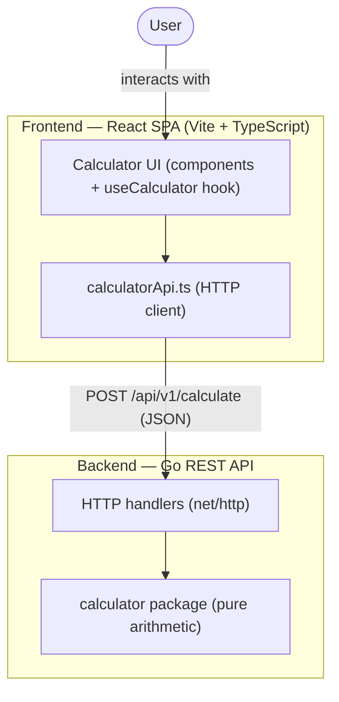
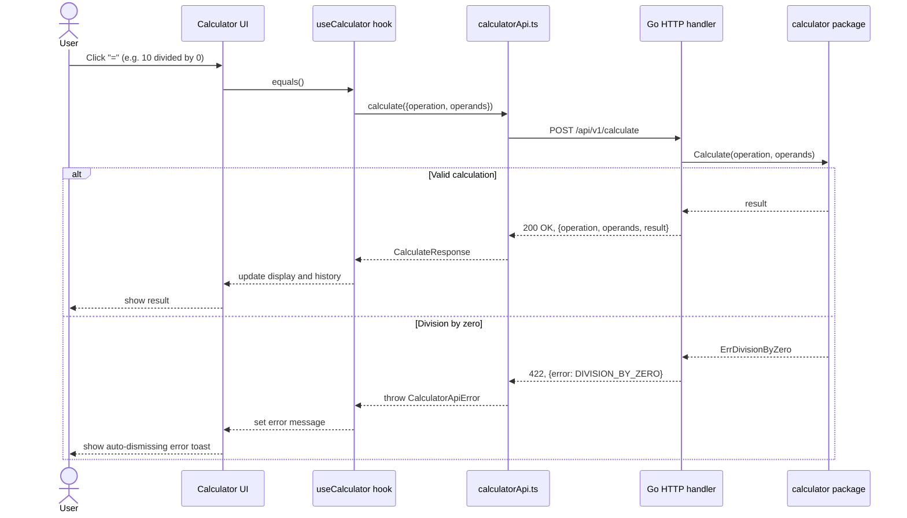
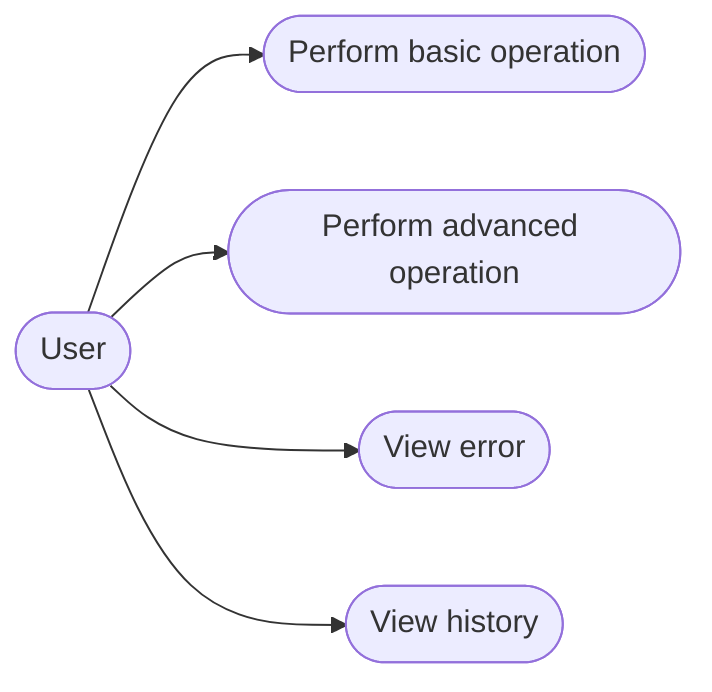
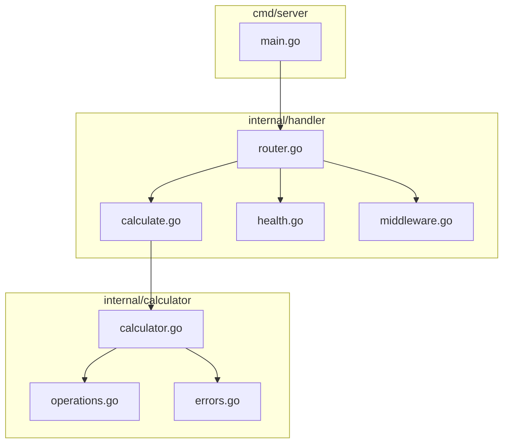

# Calculator — Full-Stack (Sezzle Challenge)

A full-stack calculator: a React + TypeScript SPA talking to a Go REST API.
Basic and advanced arithmetic (add, subtract, multiply, divide, power,
square root, percentage), strict input validation, a keyboard-accessible
UI with a light/dark theme toggle, Windows-Calculator-style operator
chaining (`5 × 3 +` evaluates `5 × 3` immediately, each step a real API
call), and a non-blocking, persisted calculation history panel. Deployable
via Docker Compose or Vercel.

## Table of contents

- [Architecture](#architecture)
- [Getting started](#getting-started)
  - [Without Docker](#without-docker)
  - [With Docker](#with-docker)
- [Deployment (Vercel)](#deployment-vercel)
- [API](#api)
- [Sequence: a calculation request](#sequence-a-calculation-request)
- [Use cases](#use-cases)
- [Backend components (optional detail)](#backend-components)
- [Design decisions and trade-offs](#design-decisions-and-trade-offs)
- [Assumptions](#assumptions)
- [Testing and coverage](#testing-and-coverage)
- [Code quality and complexity](#code-quality-and-complexity)
- [Project structure](#project-structure)
- [CI](#ci)

## Architecture



## Getting started

### Without Docker

**Backend** (requires Go 1.22+):

```bash
cd backend
go run ./cmd/server
```

The server listens on `:8080` by default. Configurable via environment
variables:

| Variable              | Default                   | Purpose                                   |
| --------------------- | -------------------------- | ------------------------------------------ |
| `PORT`                 | `8080`                      | Port the server listens on                 |
| `CORS_ALLOWED_ORIGIN`  | `http://localhost:5173`     | Value sent in `Access-Control-Allow-Origin` |

**Frontend** (requires Node 20+):

```bash
cd frontend
npm install
npm run dev
```

Opens on `http://localhost:5173` by default (Vite). To point the frontend
at a backend running somewhere other than `http://localhost:8080/api/v1`,
set `VITE_API_BASE_URL` (e.g. in `frontend/.env.local`).

### With Docker

```bash
docker compose up --build
```

This builds and starts both services:

- Backend at `http://localhost:8080`
- Frontend at `http://localhost:5173`

Stop with `docker compose down`.

## Deployment (Vercel)

Live at **[cordeirops.xyz](https://cordeirops.xyz)**.

The live deployment splits the monorepo into two separate Vercel
projects pointed at the same GitHub repo, unified under one custom
domain:

- **Backend** — Root Directory `backend`. Vercel's Go builder runs
  `cmd/server` directly (a plain `net/http.ListenAndServe` server, no
  serverless-function adapter needed). Set `CORS_ALLOWED_ORIGIN` to the
  frontend's deployed origin.
- **Frontend** — Root Directory `frontend`, framework preset Vite.
  `frontend/vercel.json` rewrites `/api/*` to the backend's Vercel URL,
  so the browser only ever talks to the frontend's own origin — the
  request becomes same-origin and CORS never enters the picture for the
  live domain. Set `VITE_API_BASE_URL` to `/api/v1` (relative, not the
  backend's full URL) so this rewrite is what's actually used in
  production.

Both env vars are build/runtime configuration only — no code changes
are needed to move between local, Docker, and Vercel.

## API

Base URL: `http://localhost:8080/api/v1`. Full machine-readable spec:
[`openapi.yaml`](openapi.yaml).

### `GET /health`

```bash
curl -s http://localhost:8080/api/v1/health
```

```json
{ "status": "ok" }
```

### `POST /calculate`

Single endpoint for every operation; the operation is selected in the
request body rather than via the URL path (see
[Design decisions](#design-decisions-and-trade-offs)).

| Operation    | Operands  | Semantics                     |
| ------------ | --------- | ------------------------------ |
| `add`        | 2         | `a + b`                        |
| `subtract`   | 2         | `a - b`                        |
| `multiply`   | 2         | `a * b`                        |
| `divide`     | 2         | `a / b`                        |
| `power`      | 2         | `a ^ b`                        |
| `sqrt`       | 1         | `√a`                            |
| `percentage` | 2         | `(a / 100) * b` — "a% of b"    |

**Success examples:**

```bash
curl -s -X POST http://localhost:8080/api/v1/calculate \
  -H "Content-Type: application/json" \
  -d '{"operation":"add","operands":[2,3]}'
# {"operation":"add","operands":[2,3],"result":5}

curl -s -X POST http://localhost:8080/api/v1/calculate \
  -H "Content-Type: application/json" \
  -d '{"operation":"divide","operands":[10,4]}'
# {"operation":"divide","operands":[10,4],"result":2.5}

curl -s -X POST http://localhost:8080/api/v1/calculate \
  -H "Content-Type: application/json" \
  -d '{"operation":"sqrt","operands":[144]}'
# {"operation":"sqrt","operands":[144],"result":12}

curl -s -X POST http://localhost:8080/api/v1/calculate \
  -H "Content-Type: application/json" \
  -d '{"operation":"percentage","operands":[50,200]}'
# {"operation":"percentage","operands":[50,200],"result":100}
```

**Error example — division by zero (`422`):**

```bash
curl -s -X POST http://localhost:8080/api/v1/calculate \
  -H "Content-Type: application/json" \
  -d '{"operation":"divide","operands":[10,0]}'
```

```json
{ "error": { "code": "DIVISION_BY_ZERO", "message": "cannot divide by zero" } }
```

**Error example — unknown operation (`400`):**

```bash
curl -s -X POST http://localhost:8080/api/v1/calculate \
  -H "Content-Type: application/json" \
  -d '{"operation":"modulo","operands":[5,2]}'
```

```json
{ "error": { "code": "UNKNOWN_OPERATION", "message": "unknown operation: \"modulo\"" } }
```

**Error example — wrong operand count (`400`):**

```bash
curl -s -X POST http://localhost:8080/api/v1/calculate \
  -H "Content-Type: application/json" \
  -d '{"operation":"add","operands":[2]}'
```

```json
{
  "error": {
    "code": "INVALID_OPERAND_COUNT",
    "message": "invalid operand count for operation: operation \"add\" requires 2 operands, got 1"
  }
}
```

### Error codes reference

| HTTP status | Code                     | Meaning                                          |
| ----------- | ------------------------- | -------------------------------------------------- |
| 400         | `INVALID_JSON`             | Malformed or empty request body                   |
| 400         | `INVALID_OPERAND`          | An operand is not a JSON number (string/bool/null) |
| 400         | `INVALID_OPERAND_COUNT`    | Wrong number of operands for the operation         |
| 400         | `UNKNOWN_OPERATION`        | `operation` is not one of the supported values     |
| 422         | `DIVISION_BY_ZERO`         | Divisor is zero                                    |
| 422         | `NEGATIVE_SQRT_OPERAND`    | `sqrt` of a negative number                        |
| 422         | `RESULT_OUT_OF_RANGE`      | Result is `+Inf`/`-Inf`/`NaN` (overflow)           |

## Sequence: a calculation request

Shown for `POST /calculate`, including the division-by-zero error branch.



## Use cases



## Backend components

Optional extra detail on how the two backend packages relate.



## Design decisions and trade-offs

- **Single `POST /calculate` endpoint instead of one endpoint per
  operation.** The operation is selected via a body field, so adding a
  new operation only means adding one entry to the backend's dispatch
  table and one union member on the frontend — the API contract itself
  never changes.
- **No web framework (`net/http` only).** Go 1.22's `http.ServeMux`
  already supports method-aware routing (`"POST /api/v1/calculate"`), so
  a router library like `chi` wouldn't add anything beyond what the
  stdlib already provides at this scope.
- **Calculation logic kept out of the HTTP layer.** `internal/calculator`
  has no knowledge of HTTP; it returns sentinel errors
  (`ErrDivisionByZero`, `ErrInvalidOperandCount`, ...) that
  `internal/handler` maps to status codes. This lets the arithmetic be
  tested with plain `go test`, with no server involved, and lets the
  handler tests focus purely on the transport/validation concerns.
- **Frontend API access isolated in one service module.**
  `src/services/calculatorApi.ts` is the only file that calls `fetch`;
  every component goes through the `useCalculator` hook, which is the
  only consumer of that service. This is what makes the hook tests able
  to mock the network layer instead of dealing with real requests.
- **400 vs. 422.** `400` is used for requests that are malformed on their
  face (bad JSON, wrong operand count, unknown operation — the server
  can't even attempt the calculation). `422` is used once the request is
  well-formed but the operation is undefined for the given input
  (division by zero, square root of a negative number, a result that
  overflows to `±Inf`/`NaN`).
- **Strict operand parsing.** Operands are decoded as `[]interface{}`
  first and explicitly type-asserted to `float64`, instead of decoding
  directly into `[]float64`. Go's `encoding/json` silently leaves a
  `null` array element at its zero value instead of erroring, which
  would have made `[2, null]` decode as `[2, 0]` with no way to tell the
  difference from a user actually sending `0`.
- **`useCalculator` as a single state-owning hook** rather than a
  reducer split across multiple files. The state machine (display,
  pending operation, loading, error, history) is small enough that a
  `useState`-based hook with a handful of named functions stays easy to
  read, and it's what the tests exercise directly with `renderHook`.
- **Operator chaining reuses the same single-operation endpoint** instead
  of adding a batch/expression endpoint or evaluating expressions
  client-side. Pressing an operator while one is already pending (e.g.
  the `+` in `5 × 3 +`) just triggers the same `POST /calculate` the
  "=" key would, immediately, using the result as the next operand —
  so multi-step calculations still never do arithmetic outside the
  backend, without touching the API contract at all.
- **The history panel has no backdrop by design.** It's a
  non-modal slide-in drawer (`HistoryPanel`): opening it never blocks
  interacting with the calculator underneath, unlike a typical
  modal-with-overlay pattern.

## Assumptions

- **`percentage` semantics.** The original brief didn't define this one
  explicitly. This implementation uses `operands: [a, b]` and computes
  "a percent of b": `result = (a / 100) * b`. So `{operation:
  "percentage", operands: [50, 200]}` → `100`.
- **All operands and results are `float64`**, so decimal input/output is
  supported throughout (e.g. `divide(10, 4)` → `2.5`).
- **A calculation result that isn't finite (`±Inf` or `NaN`, e.g. from
  `power(10, 1000)` or `power(-8, 0.5)`) is treated as a `422` semantic
  error** (`RESULT_OUT_OF_RANGE`), since `encoding/json` cannot serialize
  `Inf`/`NaN` and silently returning `0` would be misleading.
- **History is capped at the last 20 calculations** and persisted to
  `localStorage` (not a backend store) — it survives a page reload but
  is local to the browser, which is enough for "a list of recent
  operations" without standing up durable server-side storage.
- **CORS is origin-restricted, not wildcarded** (`CORS_ALLOWED_ORIGIN`,
  defaulting to the Vite dev server's origin), since this is a two-origin
  local setup rather than a public API.

## Testing and coverage

**Backend:**

```bash
cd backend
go test ./... -coverprofile=coverage.out
go tool cover -html=coverage.out -o coverage.html
```

Current coverage: `internal/calculator` 100% statements,
`internal/handler` 98.1% statements (the one uncovered branch is a
defensive `default` case for a calculator error that no current
operation can actually produce). `cmd/server` is thin env/wiring code
with no branching logic, so it isn't unit tested directly — it's covered
by the Docker/manual end-to-end runs instead.

Tests include table-driven success/error cases for every operation,
floating-point precision (`0.1 + 0.2`), overflow to `±Inf`/`NaN`,
malformed/empty JSON bodies, non-numeric/`null`/boolean operands, and a
concurrent-requests test (`go test -race` in CI) that fires 50 parallel
requests at a real `httptest.Server`.

**Frontend:**

```bash
cd frontend
npm test              # single run
npm run coverage      # with a coverage report (text + HTML)
```

Current coverage: 100% statements across all source files (services,
hooks, components, utils). Tests cover the API service (mocked `fetch`,
success/failure/network-error paths), the `useCalculator` hook in
isolation (`renderHook`), each UI component, and full end-to-end flows
through `Calculator` via both button clicks and keyboard input,
including the error-display path.

## Code quality and complexity

**Backend:**

```bash
go vet ./...
gofmt -l .
golangci-lint run ./...
gocyclo -over 10 .    # cyclomatic complexity cap
gocognit -over 15 .   # cognitive complexity cap
```

All pass clean. The most complex backend functions:

| Function                            | Cyclomatic | Cognitive |
| ------------------------------------ | :--------: | :-------: |
| `handler.mapCalculatorError`         | 6          | 1         |
| `calculator.Calculate`               | 5          | 4         |
| `handler.handleCalculate`            | 4          | 3         |
| `handler.parseOperands`              | 3          | 3         |

(Caps: 10 cyclomatic, 15 cognitive. Every other function in the backend
is at or below 2/2.)

**Frontend:** ESLint enforces the same caps via the `complexity` rule
(max 10) and `eslint-plugin-sonarjs`'s `cognitive-complexity` rule (max
15), run as part of `npm run lint`, which passes with zero warnings. The
keyboard-input handler in `Calculator.tsx` was refactored during
development from a flat if/else chain into a small lookup table
(`SIMPLE_KEY_ACTIONS`) specifically to stay under these caps.

**Asymptotic complexity.** Every calculator operation is **O(1)**: `add`,
`subtract`, `multiply`, and `percentage` are single arithmetic
expressions; `power` and `sqrt` delegate to `math.Pow`/`math.Sqrt` from
the standard library rather than an iterative implementation (e.g. power
by repeated multiplication). None of the operations touch a data
structure or iterate over input, so no operation-specific Big-O
justification beyond O(1) is needed.

## Project structure

```
/calculator
  /backend
    /cmd/server           entry point (env config, server startup)
    /internal/calculator   pure arithmetic logic, no HTTP knowledge
    /internal/handler      HTTP handlers, validation, error mapping, CORS, logging
    go.mod
  /frontend
    /src
      /components          Calculator, Display, Keypad, ErrorMessage, History,
                           HistoryPanel, ThemeToggle
      /hooks               useCalculator (calculator UI state), useTheme
      /services            calculatorApi.ts (the only module that calls fetch)
      /types               shared TS types
      /utils               formatExpression (history display formatting)
    package.json
  openapi.yaml
  docker-compose.yml
  PROMPTS.md
  README.md
```

## CI

GitHub Actions (`.github/workflows/ci.yml`) runs on every push and pull
request: backend (`go vet`, `gofmt -l`, `go build`, `go test -race
-coverprofile`) and frontend (`eslint`, `tsc -b`, `vitest run
--coverage`) as separate jobs.
